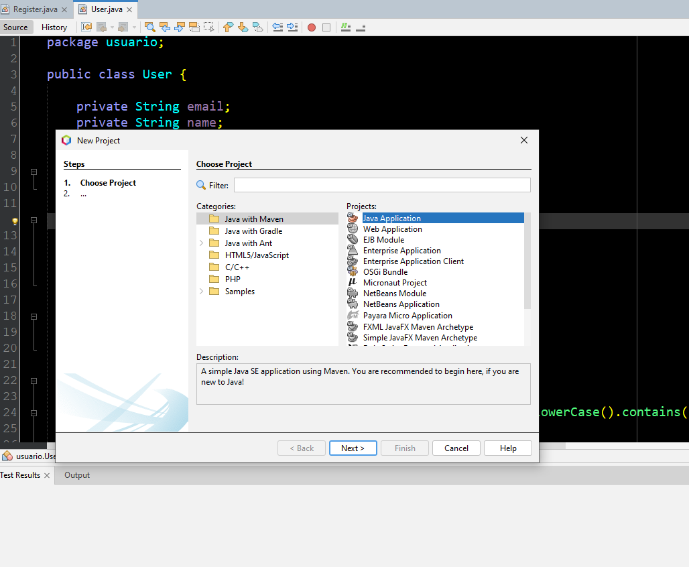
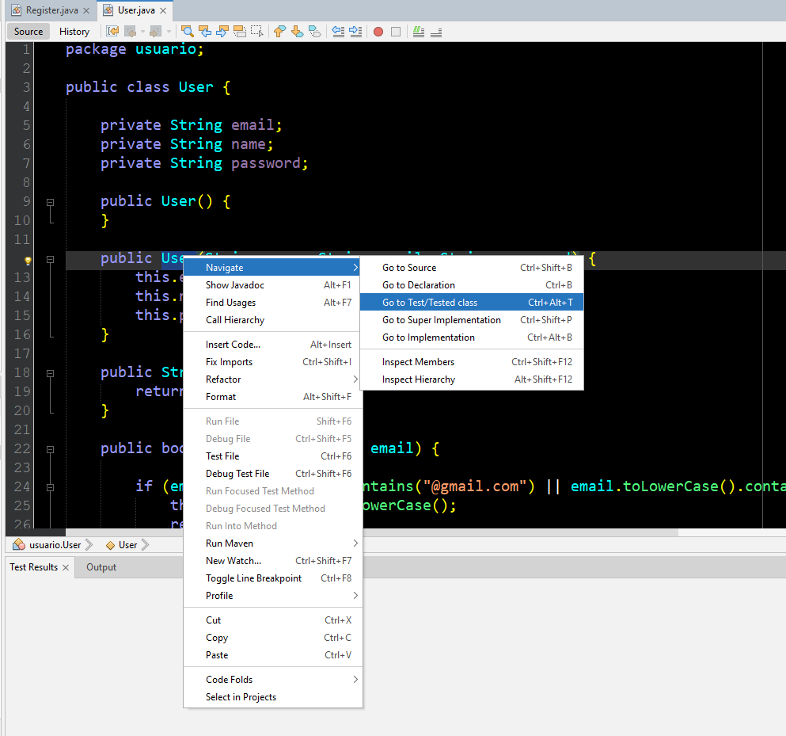

# Java desktop introdução

Este repositório contém atividades de prática sobre testes unitários com JUnit

 

## Objetivo
Aprender boas práticas ao criar códigos com o  JUnit.

## Dependências

* Instale o NetBeans - [NetBeans - Página Oficial](https://netbeans.apache.org/front/main/index.html)

 

* Instale o JDK17 para desenvolvimento em Java - [JDK17](https://download.oracle.com/java/17/archive/jdk-17.0.8_windows-x64_bin.exe)

* Ou se preferir vá para o site oficial e veja outra versão - [Oracle](https://www.oracle.com/br/java/technologies/downloads/)

 

## Como utilizar

* Após todos os processos, simplesmente abra o NetBeans e pronto, você poderá criar os seus projetos em Java com toda a estrutura do NetBeans.

 
* Faça um projeto Maven 

* Clique sobre a função desejada com o botão direito e clique em `Test/Tested Class`

## Esquema de cores

[Esquema](esquemaCoresNetBeans.pdf)

## Utilitários

[Livro](https://www.rondinha.rs.leg.br/restrito/upload/legislacao/4.pdf)

[TDD](https://www.kufunda.net/publicdocs/TDD.%20Desenvolvimento%20Guiado%20por%20Testes%20(Kent%20Beck).pdf)
